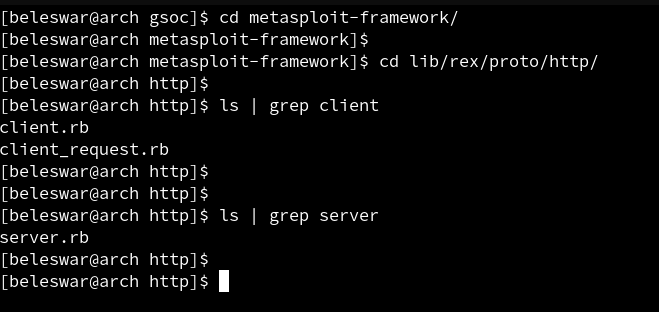

  
This article summarizes the work done during the Community Bonding Period of Google Summer of Code. It also enlists some important changes made in the Plan of work for implementing the Project in the coding period.  
  
As mentioned in my last blog post, [read it here](https://3v3ryone.github.io/gsoc/2022-06-02-introduction/), our target for GSoC is to implement the **HTTP-Trace** feature for Login Scanner Modules. Let's continue and look at the work done during the Community Bonding Period. Here is the link to my project in the GSoC site : [Project](https://summerofcode.withgoogle.com/programs/2022/projects/I4PxrljP)  
  
## What is the Community Bonding Period? 
The Community Bonding Period is dedicated for the Contributor to get familiar with the Organization's workflow and contributing guidelines. It also encourages the Contributor to communicate with their Mentor regarding the timeline of weekly tasks.
  
## Work Done in the Community Bonding Period  
  
I have contributed to Metasploit previously, so I have a good idea about the codebase and workflow. My previous contributions have equally ranged among creating issues, creating PRs, and reviewing PRs of fellow contributors. Thus, in the Community Bonding Period, I have focused on the following points:  
   
* **Successfully set up the Development Environment.** Forked the Metasploit Project Repository and set up a local development environment for working on the codebase locally and then later creating Pull Requests for merging my developed code.  
* **Set up this blog**. Yup, setting up this blog was a part of the Community Bonding work as well. Thanks to my Mentor for suggesting me the [Beautiful-Jekyll](https://github.com/daattali/beautiful-jekyll) theme, which was easy and quick to set up! This is a weekly wrap up blog which summarizes all the work done during each week for my GSoC Project.  
* **Worked on merging the existing PRs.** I am also working on merging my [Open PR](https://github.com/rapid7/metasploit-framework/pull/16094) which is about fixing the Metasploit database initialization issue in systems which use the **pg_ctl** helper for initialization (e.g. Arch Linux).  
* **Fixed Meeting times with my Mentor (Twice a Week).** Communicated with my Mentor, and we decided to work out with two meetings every week: One on Monday (the start of the week) to plan the work for the current week and the other on Friday (the closing of the week) to evaluate the work done and for feedback.  
* **Fixed work strategies and evaluation guidelines with my Mentor.** Worked out with my Mentor, and we decided to use the **Trello** app for tracking my work throughout the project. We would be dividing the whole project in weekly tasks which would be put up in Trello. Trello is a project management app which allows to track small tasks easily by pinning them in separate columns like **Backlogs**, **To-Do**, **Done** etc.  
* **Talked with mentor about improvements.** We spent a great amount of time here in investigating the related codebase of my project. This led us in realizing some improvements which we can work upon as a part of my GSoC project. These improvements are listed in the below section.  
  
## Changes in Plan: Improvements  
  
While investigating the related codebase of my HTTP-Trace project, we found out that it could be made more efficient in the following terms:  
  
I. **Allowing HTTP-Tracing for both HTTP-Client and HTTP-Server:**  
  
|  |  
| <b>Image showing both HTTP Client and HTTP Server present in Rex Library</b>|
  
As I have mentioned in my proposal, my original solution for implementing the HTTP-Trace feature was to include it in the [Rex::Proto::Http::Client](https://github.com/rapid7/metasploit-framework/blob/e957e0ea807c52d960cb8cf5b7c56fc0bee884d8/lib/rex/proto/http/client.rb) class. It is because all the modules like Auxiliary, Exploits, Gather Modules etc. make a call to the **Rex::Proto::Http::Client** class for sending the requests to the server and receive the responses back. **This solution will allow any client using HTTP to track the HTTP requests and responses, but it does not allow the servers to track those HTTP connections.** Thus, it is rather effective to create a wrapping class (which both Rex::Proto::Http::Server and Rex::Proto::Http::Client will import), where the HTTP-Trace code will be implemented, than implementing it specifically in the **Rex::Proto::Http::Client**. This will avoid code duplication and allow both clients and servers to use this HTTP-Trace functionality.  
  
II. **Improving the project timeline to study about side effects earlier:**  
  
I had originally mentioned in my proposal timeline, that I would be studying and eliminating the possible side effects of the solution, after first evaluation. But as suggested by my Mentor, a better workflow is to first study the possible side effects of the solution and then working on coding it. This is a great idea, as it can much save efforts later in case we find some major side effects of the solution we have coded throughout. Thus, I would be working on coding HTTP-Trace as well as studying side effects side by side and get them ready before the first evaluation!  
  
## Conclusion  
  
This marks the end of the Community Bonding Period of GSoC'22 :)! The Community Bonding period was really exciting and informative, where I got to know about the real-life workflow in an Organization and how to plan the timeline of the project effectively. This included Project Management, Official meetings and of course, clear communication with my Mentor. I really appreciate the essence of this period specifically dedicated to the contributors in getting acquainted to the Organization and learning about their workflow!  
  
Catch you up in the coding period! :)
