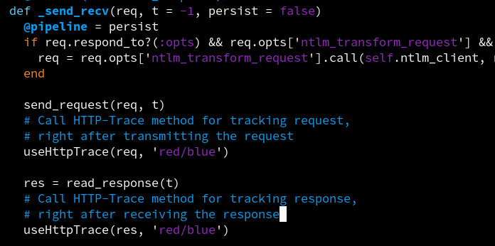

  
The Coding Period is finally here! This article summarizes the work done during the first week of the Coding Period of Google Summer of Code. The primary work during the first week was to analyze the related library code and figure out where exactly new code needs to be implemented!  
  
As mentioned in my last blog post, [read it here](https://3v3ryone.github.io/gsoc/2022-06-08-community-bonding-period/), we worked out some changes in the plan of project during the community bonding period. Thus, it was worth our time to spend the first week in analyzing the existing library code, so that we know the method calls and where exactly the HTTP-Trace wrapper class needs to be present, what parameters are needed to be passed to the method in wrapper class etc. Let's continue and look at the work done in details. Here is the link to my project in the GSoC site : [Project](https://summerofcode.withgoogle.com/programs/2022/projects/I4PxrljP)  
  
The week's work was divided into three tasks primarily. All of the tasks had specific work and combining results from all of them gave a clear view of the path of code in the next weeks.  
  
## Task 1 : Analyzing Library Code  
  
There are particularly four library files of interest with respect to this project: **Exploit::Remote::HttpClient**, **Exploit::Remote::HttpServer**, **Rex::Proto::Http::Client** and **Rex::Proto::Http::Server**. The Rex class is a central class which provides connection and configuration services for the HTTP Client (through Rex::Proto::Http::Client) and the HTTP Server (through Rex::Proto::Http::Server) to all the modules in the framework (like Auxiliary, Exploits, Encoders, Payloads etc). On the other hand, the Exploit class provides HTTP Client (Exploit::Remote::HttpClient) and HTTP Server (through Exploit::Remote::HttpServer) services only to the __exploit modules__ which fall under it.
  
Summary : Results of analysis proved that a wrapper class can be successfully created at Rex::Proto::Http location which can be imported into the above listed libraries. The analysis also found out the necessary register options and parameters needed for the method.   
  
## Task 2 : Understanding Flow of Control of Methods  
  
The library code had various methods sending requests and obtaining responses to an HTTP server. But, All of the methods have something unique in the way they craft the request and the work they perform upon the received responses. For example, **send_request_raw()**, **send_request_cgi()** and **send_request_cgi!()** are three methods of the **Exploit::Remote::Http::Client** Class which essentially send HTTP requests to the designated URI but perform a specific task with their Response. So, the question was "Do we need to make a function call to HTTP-Trace in each of these methods? Wouldn't it be inefficient with so many function calls?".  
  
Thus, understanding the flow of control and figuring out the single optimal method where the HTTP-Tracing needs to be implemented was a great challenge.  
  
The following describes every method of interest and explains their flow:  
  
1. **send_request_raw()**: This method in the Exploit::Remote::HttpClient, simply connects to the HTTP server, creates a request, sends the requests and reads the response. It lays the base for carrying out more specific functionalities on top of it. This method makes a call to the **request_raw()/request_cgi()** method and the **send_recv()** method of the Rex::Proto::Http::Client class, for crafting the Request and getting the Response respectively. Currently, the HTTP-Trace functionality is implemented in this method.  
  
2. **send_request_cgi()**: This method in the Exploit::Remote::HttpClient, is dedicated for passing a special instance of Cookie in the headers of the request. Thus, after this Cookie configuration, this method makes a call to the **send_request_raw()** method discussed above, to carry out the basic functionality.
  
3. **send_request_cgi!()**: This method in the Exploit::Remote::HttpClient, is dedicated for redirecting automatically to the URI mentioned in the response of the first request. Thus, it performs the basic functionalities like Connecting to the server, creating a request with the **COOKIE** field, sending the request, and along with that it also reads the response, if a redirect (HTTP 30x response) is received, it will attempt to follow the direct and retrieve that URI. This method makes a call to the **send_request_cgi()** method discussed above, to carry out the basic functionality.
  
4. **request_raw()**: This method in the Rex::Proto::Http::Client class, creates an arbitrary HTTP request based on the configuration options received. This is put to action to create the HTTP request when the **cgi** option is unset.  
  
5. **request_cgi()**: This method in the Rex::Proto::Http::Client class, creates a CGI compatible HTTP request. Thus, it is put to action to create the HTTP request when the **cgi** option is set.  
  
6. **send_recv()**: This method in the Rex::Proto::Http::Client class, sends a request and gets a response back. Along with it, if the response received is a 401, it attempts to authenticate to that URI with the username/password credentials and returns the final response back. This method makes a call to the `_send_recv` method for sending the request and obtaining the response back.  
  
7. `_send_recv()`: This method is solely responsible for transmitting the HTTP request and receiving the response back. It does not call any other method, and all the code for transmitting the request to the server is implemented here. Thus, this method sits on the top in the hierarchy and all the methods essentially make a call here for transmitting requests!  
  
Thus, it ultimately comes out to the `_send_recv()` method in Rex::Proto::Http::Client where the HTTP-Tracing needs to be implemented (We can make a function call to the HTTP-Trace wrapper class at this point). All the methods which craft their own requests directly or indirectly call the `_send_recv()` method for sending the request to the server and obtaining the response back!
  
## Task 3 : Objects and Parameters  
  
Now that we know where we have to make the function call for HTTP-Trace, we have to determine what objects and parameters are needed to be passed to the function, for effective tracking of HTTP requests and responses. After analyzing the library code, we believe it is sufficient to pass the following parameters for effective tracking:  
  
1. **request object**: The request object containing all configurations like URI, Port, SSL, Headers, Method, Connection, Cookie etc. We could call the HTTP-Trace method with this request object as parameter just after the request is ready to be transmittied to the HTTP server.  
  
2. **response object**:  The response object containing all configurations like Response code, Server, Location, Content-Type etc. We could call the HTTP-Trace method with this response object as parameter just after we have received the response from the HTTP server.  
  
3. **colors**:  A pair of colors can be passed as parameter as well along with requests and responses. This will help to distinguish the requests and responses when they are printed into the msfconsole with unique colors each. So, we could pass the colors parameter in the style `color1/color2` for requests and responses respectively.  
  
  
|  |  
| <b> Image showing a sample method call to HTTP-Trace method with parameters from the `_send_recv` method </b>|  
  
## Conclusion  
  
Its a wrap for Week 1 :)! The research work in this week was very informative, which clarified the location and parameters of the function call to HTTP-Trace method. Thus, our next plan in Week 2 is to actually create the wrapper class in Rex::Proto::Http library and define the HTTP-Trace method with the above parameters.  
  
Catch you up in the second week! :)
