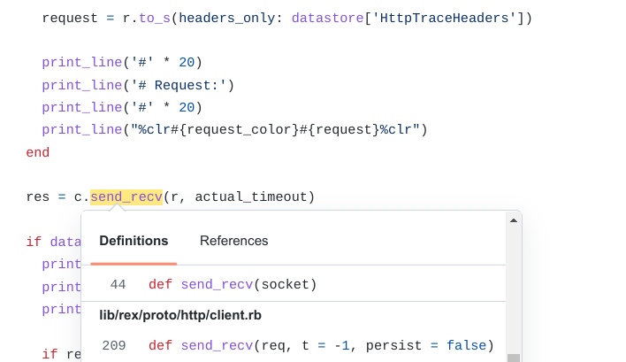

  
The Coding Period is finally here! This article summarizes the work done during the first week of the Coding Period of Google Summer of Code. The primary work during the first week was to analyze the related library code and figure out where exactly new code needs to be implemented!  
  
As mentioned in my last blog post, [read it here](https://3v3ryone.github.io/gsoc/2022-06-08-community-bonding-period/), we worked out some changes in the plan of project during the community bonding period. Thus, it was worth our time to spend the first week in analyzing the existing library code, so that we know the method calls and where exactly the HTTP-Trace wrapper class needs to be present, what parameters are needed to be passed to the method in wrapper class etc. Let's continue and look at the work done in details. Here is the link to my project in the GSoC site : [Project](https://summerofcode.withgoogle.com/programs/2022/projects/I4PxrljP)  
  
The week's work was divided into three tasks primarily. All of the tasks had specific work and combining results from all of them gave a clear view of the path of code in the next weeks.  
  
## Task 1 : Analyzing Library Code  
  
There are particularly four library files of interest with respect to this project: **Rex::Proto::Http::Client**, **Rex::Proto::Http::Server**, **Exploit::Remote::HttpClient** and **Exploit::Remote::HttpServer**. The Rex class is a central class which provides connection and configuration services for the HTTP Client (through Rex::Proto::Http::Client) and the HTTP Server (through Rex::Proto::Http::Server) to all the modules in the framework (like Auxiliary, Exploits, Encoders, Payloads etc). On the other hand, the Exploit class provides HTTP Client services (through Exploit::Remote::HttpClient) and HTTP Server services (through Exploit::Remote::HttpServer) only to the _exploit modules_ which fall under it.  
  
In the process of researching through the codebase, I found that the Exploit::Remote::HttpClient is reliant on the Rex::Proto::Http::Client for making requests to the server and obtaining back the responses. In the same way, Exploit::Remote::HttpServer is reliant on the Rex::Proto::Http::Server class for sending responses back to the Client. Thus, the Exploit class does not transmit requests on it's own, rather it makes a call to the methods of Rex class for doing so. Thus, our plan of creating the HTTP-Trace wrapper class for Rex::Proto::Http::Client and Rex::Proto::Http::Server will also serve the Exploit::Remote::Http::Client and Exploit::Remote::Http::Server with HTTP-Trace features since the later are reliant on the former.  
  
|  |  
| Code Example showing that _send_request_raw()_ method in [Exploit::Remote::HttpClient](https://github.com/rapid7/metasploit-framework/blob/master/lib/msf/core/exploit/remote/http_client.rb#L356-L406) is reliant on _send_recv()_ method in [Rex::Proto::Http::Client](https://github.com/rapid7/metasploit-framework/blob/98b2234cab8cbb60f6907a268f65e69de7b7aae7/lib/rex/proto/http/client.rb#L146-L154) |
  
|  |  
| Code example showing that _send_response()_ method in [Exploit::Remote::HttpServer](https://github.com/rapid7/metasploit-framework/blob/master/lib/msf/core/exploit/remote/http_server.rb#L553-L583) is reliant on _send_response()_ method in [Rex::Proto::Http::Server](https://github.com/rapid7/metasploit-framework/blob/98b2234cab8cbb60f6907a268f65e69de7b7aae7/lib/rex/proto/http/server.rb#L35-L45) |  
  
While analyzing the Client files, i.e Rex::Proto::Http::Client and Exploit::Remote::HttpClient, it was marked that the HTTP Client sends different types of requests (e.g. Cookies, follow redirect etc.) to the server and grabs the response. Thus, it is essential to track both requests and responses on the Client side through HTTP-Trace.  
  
On the other hand, analyzing the Server files, i.e Rex::Proto::Http::Server and Exploit::Remote::HttpServer, showed that the HTTP Server just sends different types of responses (e.g. 404 error, 302 redirect etc.) to the client through it's __send_response()__ method. Thus, it is just sufficient to track only responses on the Server side through HTTP-Trace.
  
Thus, results of the analysis proved that a wrapper class can be successfully created at Rex::Proto::Http location which can be imported into the above listed libraries. The analysis also found out the necessary register options and parameters needed for the HTTP-Trace method, which are listed in the TASK 3 section.   
  
## Task 2 : Understanding Flow of Control of Methods  
  
The Server library code is simple, because we have just one method `send_response()` in Rex::Proto::Http::Server which sends the HTTP response to the client. Thus, we can implement HTTP-Trace in the `send_response()` method by making a call to the HTTP-Trace wrapper class in this location.  
  
However, the Client library code had various methods sending requests and obtaining responses to an HTTP server. All of the methods have something unique in the way they craft the request and the work they perform upon the received responses. For example, **send_request_raw()**, **send_request_cgi()** and **send_request_cgi!()** are three methods of the **Exploit::Remote::Http::Client** Class which essentially send HTTP requests to the designated URI but perform a specific task with their Response. So, the question was "Do we need to make a function call to HTTP-Trace in each of these methods? Wouldn't it be inefficient with so many function calls?".  
  
Thus, understanding the flow of control and figuring out the single optimal method where the HTTP-Tracing needs to be implemented was a great challenge.  
  
The following describes every method of interest and explains their flow:  
  
1. **send_request_raw()**: This method in the Exploit::Remote::HttpClient, simply connects to the HTTP server, creates a request, sends the requests and reads the response. It lays the base for carrying out more specific functionalities on top of it. Currently, the HTTP-Trace functionality is implemented in this method. This method makes a call to the **send_recv()** method of the Rex::Proto::Http::Client class, for sending the Request and getting the Response. (**send_recv()** method further forwards the request to `_send_recv()` method where the request gets transmitted. See Point 4.)  
  
2. **send_request_cgi()**: This method in the Exploit::Remote::HttpClient, is dedicated for passing a special instance of Cookie in the headers of the request. Thus, after this Cookie configuration, this method makes a call to the **send_request_raw()** method discussed above, to carry out the basic functionality. (Callstack = **send_request_cgi()** -> **send_request_raw()** -> **send_recv()** -> `_send_recv()`. See Point 1. )  
  
3. **send_request_cgi!()**: This method in the Exploit::Remote::HttpClient, is dedicated for redirecting automatically to the URI mentioned in the response of the first request. Thus, it performs the basic functionalities like Connecting to the server, creating a request with the **COOKIE** field, sending the request, and along with that it also reads the response, if a redirect (HTTP 30x response) is received, it will attempt to follow the direct and retrieve that URI. This method makes a call to the **send_request_cgi()** method discussed above, to carry out the basic functionality. (Callstack = **send_request_cgi!()** -> **send_request_cgi()** -> **send_request_raw()** -> **send_recv()** -> `_send_recv()`. See Point 2. ) 
  
4. **send_recv()**: This method in the Rex::Proto::Http::Client class, sends a request and gets a response back. Along with it, if the response received is a 401, it attempts to authenticate to that URI with the username/password credentials and returns the final response back. This method makes a call to the `_send_recv()` method for sending the request and obtaining the response back. 
  
5. `_send_recv()`: This method is solely responsible for transmitting the HTTP request and receiving the response back. It does not call any other method, and all the code for transmitting the request to the server is implemented here. Thus, this method sits on the top in the hierarchy and all the methods essentially make a call here for transmitting requests!  
  
|  |  
| An infographic showing the Flow of Control of methods |    
  
Thus, it ultimately comes out to the `_send_recv()` method in Rex::Proto::Http::Client where the HTTP-Tracing needs to be implemented (We can make a function call to the HTTP-Trace wrapper class at this point). All the methods which craft their own requests directly or indirectly call the `_send_recv()` method for sending the request to the server and obtaining the response back!  
  
## Task 3 : Objects and Parameters  
  
Now that we know where we have to make the function call for HTTP-Trace, we have to determine what objects and parameters are needed to be passed to the function, for effective tracking of HTTP requests and responses. After analyzing the library code, I believe it is sufficient to pass the following parameters for effective tracking:  
  
1. **request object**: The request object containing all configurations like URI, Port, SSL, Headers, Method, Connection, Cookie etc. We could call the HTTP-Trace method with this request object as parameter just after the request is ready to be transmittied to the HTTP server.  
  
2. **response object**:  The response object containing all configurations like Response code, Server, Location, Content-Type etc. We could call the HTTP-Trace method with this response object as parameter just after we have received the response from the HTTP server.  
  
3. **colors**:  A pair of colors can be passed as parameter as well along with requests and responses. This will help to distinguish the requests and responses when they are printed into the msfconsole with unique colors each. So, we could pass the colors parameter in the style `color1/color2` for requests and responses respectively.  
  
  
|  |  
| <b> Image showing a sample method call to HTTP-Trace method with parameters from the `_send_recv` method </b>|  
  
## Conclusion  
  
Its a wrap for Week 1 :)! The research work in this week was very informative, which clarified the location and parameters of the function call to HTTP-Trace method. Thus, our next plan in Week 2 is to actually create the wrapper class in Rex::Proto::Http library and define the HTTP-Trace method with the above parameters.  
  
Catch you up in the second week! :)
