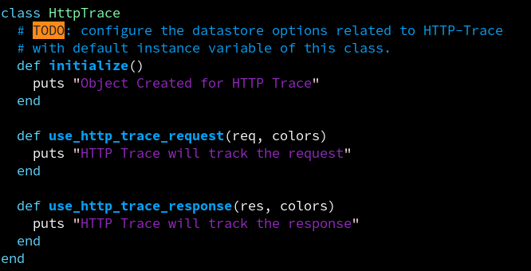
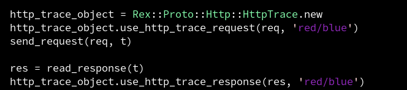
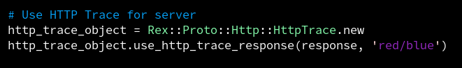
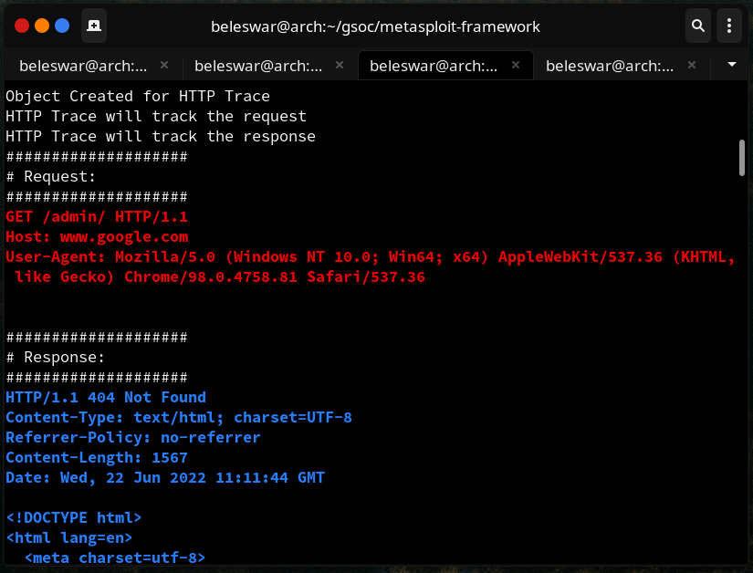
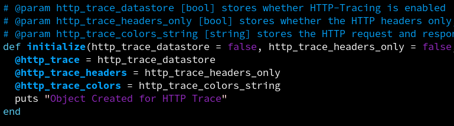
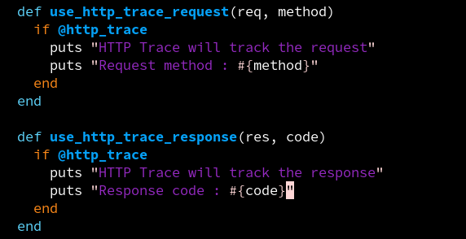
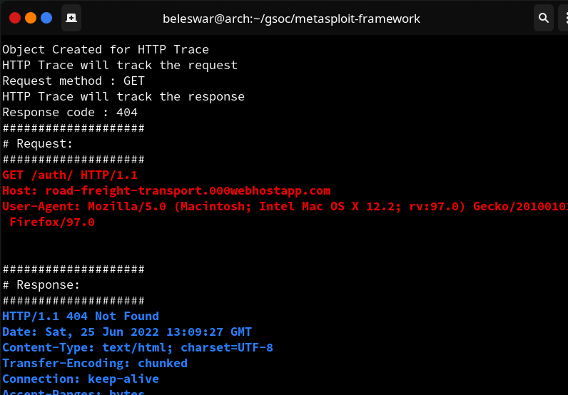

  
This article summarizes the work done during the second week of the coding period of Google Summer of Code. The primary work done during this week was to create a wrapper class for HTTP-Trace at the [Rex::Proto::Http](https://github.com/rapid7/metasploit-framework/tree/master/lib/rex/proto/http) library and establish the connection between this class with [Rex::Proto::Http::Client](https://github.com/rapid7/metasploit-framework/blob/master/lib/rex/proto/http/client.rb) and [Rex::Proto::Http::Server](https://github.com/rapid7/metasploit-framework/blob/master/lib/rex/proto/http/server.rb), to enable the tracking of requests and responses.  
  
As mentioned in my [last blog post](https://3v3ryone.github.io/gsoc/2022-06-17-first-week/), the optimal location for implementing HTTP-Trace was determined to be in the `_send_recv()` method for **Rex::Proto::Http::Client**, and in the `on_client_data()` and `send_response()` methods for **Rex::Proto::Http::Server**. These methods will create an object of the wrapper class and call the wrapper class's methods through the object. Thus, the work for this week was to create the wrapper class and define some initial functionalities in its methods. Let's continue and look at the work done in detail. Here is the link to my project on the GSoC site: [Project](https://summerofcode.withgoogle.com/programs/2022/projects/I4PxrljP)  
  
## PR Workstyle
  
We decided to work on my fork of `rapid7/metasploit-framework`. A branch `GSoC-add-Http-Trace` was created on my repository: `3V3RYONE/metasploit-framework`, which aims to hold all the changes done for my project. We decided to create feature branches on my repo to implement specific functionalities such as `create-wrapper-class`, `add-HTTP-Trace`, etc. The idea is to create a pull request from these unique feature branches to the central `GSoC-add-Http-Trace` branch on my repo. So, after all the features related to my GSoC project are merged, we make the final pull request from `GSoC-add-Http-Trace` branch on my repo to the `master` branch on `rapid7/metasploit-framework`. This will allow us to track our work better since we can easily review changes done in the single feature branch PRs, and then create a single final pull request at the end to the mainstream repo will be convenient for maintainers to overview the whole GSoC work in a single PR, rather than targeting all PRs at the rapid7 repo which would have resulted in a number of smaller PRs containing incomplete work.  
  
## Task 1: Creating the wrapper class  
  
Now, we have a name to our wrapper class: **Rex::Proto::Http::HttpTrace**. Currently, it has 2 methods (`use_http_trace_request()` and `use_http_trace_response()`) and the class constructor `initialize()`. As the name suggests, `use_http_trace_request()` is used for tracking the HTTP request passed to it as parameter and `use_http_trace_response()` is used to track the HTTP response passed to it as parameter.  
  
As a part of the initial implementation, the `initialize()` method just prints a static message saying _"Object has been created for HTTP-Trace"_, and the other two methods print the static messages _"HTTP-Trace will track the request"_ and _"HTTP-Trace will track the response"_ respectively. Although the messages aren't much informative, this step was important as we had to first ensure that a connection could be successfully established whenever the object of the class is initialized or methods of the class are called through the object.  
  
|  |
| <b>Figure 1: Code example showing initial implementation done in</b>
 <b>Rex::Proto::Http::HttpTrace </b>|
  
 
## Task 2: Establishing the connection between wrapper class and Client and Server  
  
After the initial wrapper class was created, the next task was to utilize this wrapper class's functionality in the Client and Server library files, i.e. to establish the connection between those classes. This was done by creating an object of the **Rex::Proto::Http::HttpTrace** class in **Rex::Proto::Http::Client** and **Rex::Proto::Http::Server** and calling the methods of the **Rex::Proto::Http::HttpTrace** class for tracking requests and responses by passing appropriate parameters.  
  
Thus, to establish the connection between **Rex::Proto::Http::HttpTrace** and **Rex::Proto::Http::Client**, the object of **Rex::Proto::Http::HttpTrace** was created (named **http_trace_object**) in the `_send_recv()` method and the **use_http_trace_request()** and **use_http_trace_response()** methods were invoked through this object. For **Rex::Proto::Http::Server**, the http_trace_object was created separately in two methods (`on_client_data()` and `send_response()`) to track request and response respectively.  
  
|  |  
| <b>Figure 2: Code example showing object creation of </b>|
 <b>Rex::Proto::Http::HttpTrace class in Rex::Proto::Http::Client </b>|
  
 
  
|  |  
| <b>Figure 3: Code example showing object creation of </b>|
 <b>Rex::Proto::Http::HttpTrace class in Rex::Proto::Http::Server </b>|  
  
The connection was successful and it was verified through the output. That is, now the Client and Server can successfully make a call to the HTTP-Trace wrapper class for tracking their requests and responses.  
  
|  |  
| <b>Figure 4: Image showing the initial output of HTTP-Trace functionality </b>|
 <b> which verifies the established connection </b>|  
  
 
## Task 3: Improvements  
  
Now that I was sure the connection between **Rex::Proto::Http::HttpTrace**, **Rex::Proto::Http::Client**, and **Rex::Proto::Http::Server** was established, I worked upon giving a more relevant and meaningful definition to the methods of the wrapper class. The `initialize()` method now takes the datastore parameters like HttpTrace, HttpTraceHeadersOnly and HttpTraceColors. HttpTrace parameter stores whether HttpTracing is enabled in msfconsole. HttpTraceHeadersOnly parameter stores whether only the HTTP Headers are needed to be tracked to msfconsole. HttpTraceColors stores the pair of colors to be used for printing requests and responses intuitively.  
  
Now, instance variables were created and were used to store these parameters. Instance variables ensure that we can use their value, for the current object in scope, anywhere in the **Rex::Proto::Http::HttpTrace** class. This improvement also ensures that whenever an object is created for HttpTrace wrapper class, we have the datastore options related to HTTP-Trace ready, and we need not repeatedly pass these options while making a function call now.  
  
|  |  
| <b>Figure 5: Code example showing improvements in the `initialize()` method </b>|
 <b>of Rex::Proto::Http::HttpTrace </b>|  
  
Also, the two methods (`use_http_trace_request` and `use_http_trace_response`) of the wrapper class were defined in a better fashion. Now, instead of printing static messages, we are trying to print some information related to the request and response. Firstly, we are checking for the value of the instance variable `@http_trace`, if it's set to true, then only the static messages are printed, else they are not. Along with the static messages, we are printing the **request method** in case of request tracking and the **response code** in case of response tracking. This was done by accepting an additional parameter **method/code** for request/response respectively. This also removed the redundant parameter **colors** as we need not pass it every time the method is called.
  
|  |  
| <b>Figure 6: Code example showing improvements in </b>|
 <b>`use_http_trace_request()` and `use_http_trace_response()` methods </b>|
 <b>of Rex::Proto::Http::HttpTrace </b>|  
  
 
  
|  |  
| <b>Figure 7: Image showing the revised output of HTTP-Trace functionality </b>|    
  
All the work discussed above has been implemented in the feature branch `create-wrapper-class-Week2`of my repo. The pull request from the feature branch to the central GSoC branch was then reviewed by my mentor, following which it was merged into the central branch. You may see the [pull request](https://github.com/3V3RYONE/metasploit-framework/pull/1) to look at the entire code of the wrapper class.  
  
## Note
  
Currently, the requests and responses are directly not printed to the console in the methods of **Rex::Proto::Http::HttpTrace** wrapper class because the HttpTrace datastore option is implemented in the **Exploit::Remote::HttpClient** mixin. So, now, even if we **set HTTP-Trace=false** in msfconsole, we would still get the requests and responses tracked to msfconsole because the datastore option does not point to the **Rex::Proto::Http::HttpTrace** wrapper class now. Thus, the full functionality of printing requests and responses isn't implemented now in HTTP-Trace methods to prevent this anomaly, and they will be implemented once the datastore options have been ported from **Exploit::Remote::HttpClient** to **Rex::Proto::Http::Client**.  
  
## Conclusion  
  
It's a wrap for Week 2 :) The **Rex::Proto::Http::HttpTrace** wrapper class created here lays the base for the additional functionalities to be added in upcoming weeks. This also successfully established the connection between HttpTrace class with the **Rex::Proto::Http::Client** and **Rex::Proto::Http::Server** class. Thus, our next plan in Week 3 is to implement the full HTTP-Trace functionalities in the **use_http_trace_request()** and **use_http_trace_response()** methods of the **Rex::Proto::Http::HttpTrace** wrapper class and implement the datastore options in the **Rex::Proto::Http::Client** and **Rex::Proto::Http::Server** to make msfconsole work with the HttpTrace wrapper class.  
  
Catch you up in the third week! :)  
