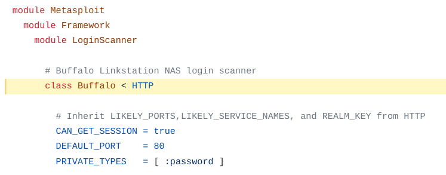
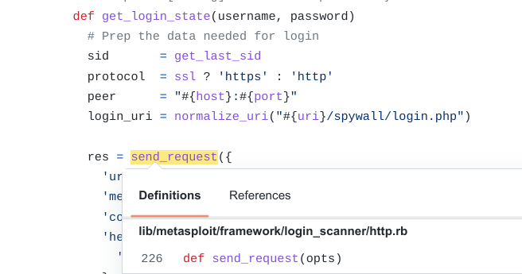
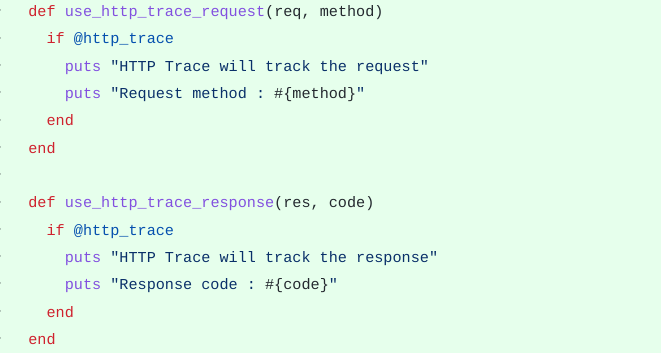
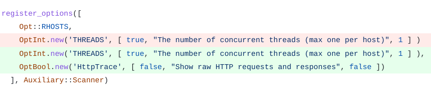
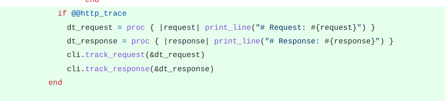
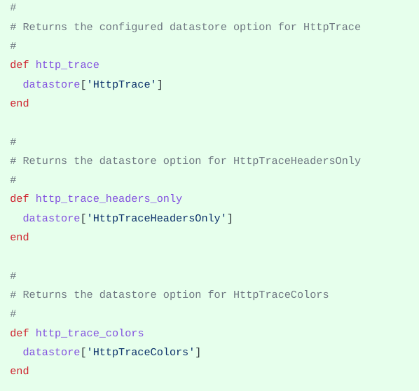
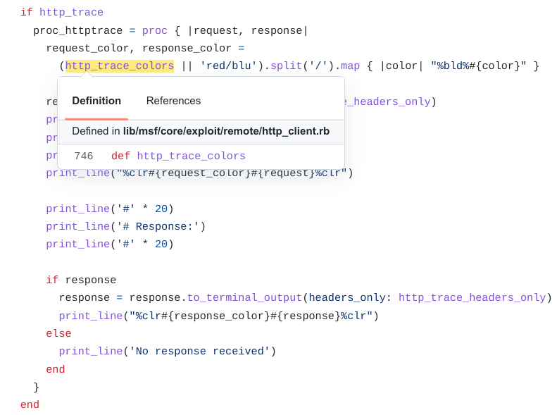
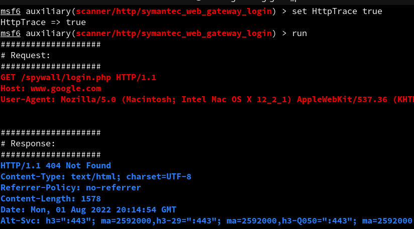

  
This article summarizes the work done during the Week 2 to Week 6 of the coding period of Google Summer of Code. The primary work done during this period was to implement the datastore options related to HTTP-Trace in the Msf:: namespace and access it in the Rex:: namespace. For readers coming from my last blog post, this might seem a drastic change in workflow.  
  
The initial plan was to implement the datastore options in the **Rex::** namespace and log HTTP requests and responses there as well. But the current plan is a lot different. Now, we are defining the datastore options in the **Msf::** namespace and accessing them in the **Rex::** namespace. The code to log requests and responses is also written as a proc in the **Msf::** namespace which is passed onto **Rex::** namespace. So, in this solution **Rex::** namespace is not defining anything on its own, rather it's just accessing the elements defined in the **Msf::** namespace. Let's continue and look at the work done in detail. Here is the link to my project on the GSoC site: [Project](https://summerofcode.withgoogle.com/programs/2022/projects/I4PxrljP)  
  
## Background
  
Since we can not implement datastore options in the **Rex::** namespace (see Approach#1), the need of the hour was to find another common library which is used by all login scanners where we can implement datastore now. After doing some research in the codebase, I found that the common library is defined in the **Metasploit::** namespace, which is the intermediate layer in the API of Metasploit Framework (**Rex::** > **Metasploit::** > **Msf::**). The **Metasploit::Framework:: LoginScanner::HTTP** library in particular forwards all HTTP requests sent by the login scanner modules, to the **Rex::Proto::Http::Client** class from here and receives it's response back. The following examples show that all the login scanners are reliant upon the **Metasploit::Framework::LoginScanner::HTTP** common library.   
  
|  |  
| <b>Figure 1: Code example 1 showing the Buffalo Login Scanner library</b>|
 <b> inherits from Metasploit::Framework::LoginScanner::HTTP </b>|
  
 
  
|  |  
| <b>Figure 2: Code example 2 showing the Symantec Web Gateway login scanner </b>|
  <b> calls Metasploit::Framework::LoginScanner::Http#send_request() </b>|
  
Note, while the above methodology is the ideal process for every login scanner module to send requests to the server, there are some login scanner modules which make a call to the **Rex::Proto::Http::Client** library directly without touching the **Metasploit::** API. So, much of my work after the mid-terms would be to explicity re-construct these login scanners to make them call to the **Metasploit::** API rather than directly touching **Rex::** code.  
  
## Approach#1  
#### Implement Datastore in Rex:: namespace - Failed
  
The first approach to solve this  was to implement the register options for HTTP-Trace in the **Rex::Proto::Http::Client** class. Now since the register option is defined in the same library, it would have been very easy to check the value of the HttpTrace option (set by the user to either True or False) inside the **Rex::Proto::Http::Client** class. This solves all the concerns related to Login Scanners easily.  
  
But the only problem with this approach is the API. The API in the Metasploit Framework is implemented in sort of layers, with **Rex::** being the top layer and **Msf::** being the bottom layer and **Metasploit::** in the intermediate part. So we can not access **Msf::** code from **Rex::** code directly but the vice versa is possible. So, I can not directly implement a register option in the **Rex::** namespace, neither can we use print statements for logging in the **Rex::** layer. This is because the **Rex::** layer is meant to work independently as a gem and it should not access Metasploit code in any ways. So, we can not implement register options in this library since register options are limited to the Metasploit codebase only. The code related to Metasploit codebase only should be written in the **Msf::** namespace. Thus, this attempt was put down and I researched more into finding a better location of implementing the HTTP-Trace register options.  
  
This [pull request](https://github.com/3V3RYONE/metasploit-framework/pull/1) introduces code in the **Rex::** namespace which logs HTTP requests and responses by using print statements. This is not ideal since we should not use print statements directly in the **Rex::** namespace. The solution to this is using a callback which I worked upon in Approach#3.  
  
|  |  
| <b>Figure 3: Code example showing the usage of print statements in </b>|
  <b> Rex:: namespace, which is not ideal </b>|

   
## Approach #2
#### Implement Datastore in Msf::Auxiliary::Scanner - Failed
  
The next attempt to solve this was to define the HTTP-Trace register options in the **Msf::Auxiliary::Scanner** mixin. Every generic scanner modules (and thus login scanners) include this mixin and since it's defined in the **Msf::** namespace, we can easily implement register options here and check their values through datastore. If datastore['HttpTrace'] is set to true, we define a block containing print statments requried for logging HTTP requests and responses, and pass it as a proc to the **Rex::Proto::Http::Client** class.  
  
|  |  
| <b>Figure 4: Code example showing that datastore['HttpTrace'] is </b>|
  <b> used as a register option in Msf::Auxiliary::Scanner </b>|
  
 
  
|  |  
| <b>Figure 5: Code example showing Metasploit::Framework::LoginScanner::HTTP </b>|
  <b> accessing the datastore implemented in Msf::Auxiliary::Scanner</b>|
  <b> and then defining a proc </b> |
  
Checkout these [commits](https://github.com/rapid7/metasploit-framework/compare/master...3V3RYONE:metasploit-framework:sample-code-changes-httptrace) which I created on a sample branch to show my approach to the mentors.  
  
This is feasible and does not break any dependency of the API like in Approach#1, but the problem in this method is the **Msf::Auxiliary::Scanner** mixin is included in other generic scanner modules as well. For example, it is being included in the non-HTTP scanners like **smb_version** as well. We do not have any usage of HTTP-Trace in generic scanner modules (non-HTTP trace modules). So, this method was ruled out as well, because it makes HTTP-Trace options available to generic scanner modules as well, which may not use it anyhow.  
  

## Approach#3
#### Implement datastore in Msf:: namespace and export it via a method - Accepted
  
The final attempt to solve this was to use the datastore defined in the **Msf::Core::Exploit::Remote::Http::Client**, from the **Metasploit::Framework::LoginScanner::HTTP** class. So, here we are able to access the datastore defined in a different namespace without actually including it in the class, which does not violate any dependencies now. So, I defined three methods (**http_trace()**, **http_trace_headers_only()** and **http_trace_colors()**) in the **Msf::Core::Exploit::Remote::Http::Client** mixin which returns the respective datastore values. These methods are then called from the **Metasploit::Framework::LoginScanner::HTTP** class to check the value of datastore['HttpTrace'] and set the proc accordingly. The proc is then forwarded to the **Rex::Proto::Http::Client** which makes a callback to the proc with the request and response objects.  
  
|  |  
| <b>Figure 6: Code example showing the methods returning current </b>|
  <b> datastore values in Msf::Core::Exploit::Remote::HttpClient </b>|
  
 
  
|  |  
| <b>Figure 7: Code example showing Metasploit::Framework::LoginScanner::HTTP </b>|
  <b> accessing the datastore by calling the method and then defining a proc</b>|
  
Since the **Metasploit::Framework::LoginScanner::HTTP** class is the central class for all login scanners to send requests to the server, we are now able to use the HTTP-Trace option for login scanner modules. This method is the accepted method of working as of mid-term evaluations. Checkout this [pull request](https://github.com/3V3RYONE/metasploit-framework/pull/4) to check the detailed code.  

|  |  
| <b>Figure 8: Image showing HTTP-Trace output for Symantec_Web_Gateway login scanner </b>| 
  
 
  
## Note
  
Currently, there are some login scanner modules which do not access the **Metasploit::** API, and directly call the **Rex::** class for sending requests and responses (e.g. [buffalo_login](https://github.com/rapid7/metasploit-framework/blob/master/lib/metasploit/framework/login_scanner/buffalo.rb#L36-L49). So, HTTP-Trace feature will not work for those modules as of now.  
  
## Conclusion  
  
It's a wrap for Mid-Terms :) Our plan for next week is to re-construct those login scanner modules which do not access the **Metasploit::** API currently. After this, all the login scanner modules should be able to use the HTTP-Trace feature easily.  
  
Catch you up in the next week! :)  
